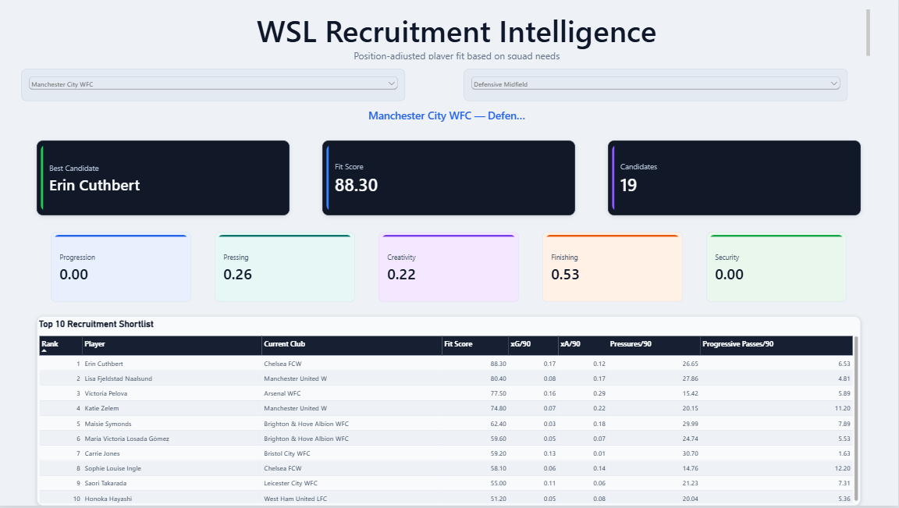

# WSL Recruitment Intelligence Platform

**An end-to-end football recruitment analytics project using Python, PostgreSQL and Power BI to identify squad weaknesses and rank external players by club-specific tactical fit.**



## Project summary

Most player dashboards answer a generic question: **who has the best numbers?**

This project asks a more practical recruitment question:

> **Given a club's existing squad profile at a specific position, which external players best address its weaknesses?**

I built a pipeline that transforms raw StatsBomb event data into player performance metrics, normalises those metrics by minutes and position, measures club-position gaps against league benchmarks, and converts those gaps into a weighted recruitment score. The final Power BI dashboard lets a user select a **target club + position** and immediately inspect the resulting top-10 shortlist.

## What I built

- Downloaded and flattened a complete **132-match WSL 2023/24 season** from StatsBomb Open Data.
- Processed **495,189 event records** with Python.
- Built PostgreSQL staging, warehouse and analytics layers with explicit table grains.
- Reconstructed player minutes from event data after detecting inconsistent tactical-shift timing in lineup records.
- Created per-90 metrics for shooting, creation, progression and pressing.
- Used SQL window functions to calculate **position-adjusted percentiles**.
- Built five interpretable player attributes: finishing, creativity, progression, pressing and possession security.
- Compared each **club × position group** against league benchmarks to identify recruitment needs.
- Ranked eligible external players using a club-specific weighted **sporting-fit score**.
- Built an interactive Power BI report with club/position slicers, DAX KPIs and a top-10 recruitment shortlist.

## Tech stack

| Layer | Technology | Purpose |
|---|---|---|
| Source | StatsBomb Open Data | Match, event and lineup JSON |
| ETL | Python | Download, flatten and reconstruct player minutes |
| Database | PostgreSQL | Staging, warehouse, metrics and recruitment model |
| SQL | PostgreSQL SQL | Joins, CTEs, window functions, views and validation |
| BI | Power BI | Interactive recruitment decision dashboard |
| BI logic | DAX / Power Query | Dynamic KPIs, filters and composite relationship key |

## Architecture

```mermaid
flowchart LR
    A[StatsBomb JSON] --> B[Python ETL]
    B --> C[PostgreSQL staging]
    C --> D[Warehouse dimensions + player-match fact]
    D --> E[Per-90 metrics]
    E --> F[Position percentiles]
    F --> G[Player attribute scores]
    G --> H[Club-position squad gaps]
    H --> I[Sporting-fit ranking]
    I --> J[Reporting views]
    J --> K[Power BI dashboard]
```



## Recruitment model

The model is deliberately **club-position specific**.

For example, a club can be strong at centre-back but weak at winger. Averaging the whole club would hide that difference, so recruitment requirements are evaluated separately for combinations such as:

```text
Manchester City WFC × Defensive Midfield
Manchester City WFC × Winger
Chelsea FCW × Full Back
Chelsea FCW × Striker
```

### 1. Position-adjusted player performance

Players with at least **900 minutes** are compared only with players in the same broad position group. PostgreSQL's `PERCENT_RANK()` converts per-90 metrics to `0–100` position-relative scores.

### 2. Five player attributes

Percentiles are combined into:

- **Finishing** — primarily xG and box involvement.
- **Creativity** — xA, key passes and box entries.
- **Progression** — progressive passes/carries and final-third entries.
- **Pressing** — pressure, high-pressure and counterpressure activity.
- **Possession Security** — pass completion plus recovery/interception contribution.

The weights are transparent modelling assumptions and are documented in [`docs/methodology.md`](docs/methodology.md).

### 3. Squad needs

For each club-position group:

```text
attribute gap = max(league position benchmark - club position score, 0)
```

Positive gaps are normalised into recruitment weights. The weakest attributes therefore receive the largest influence in candidate scoring.

### 4. Candidate fit

Candidates must:

- play in the same position group;
- play for another WSL club;
- meet the 900-minute threshold.

Their attribute scores are multiplied by the target club-position need weights and summed into a `0–100` sporting-fit score.

This means the **same player can rank differently for different clubs**.

## Example dashboard output

The included screenshot shows the model evaluating **Manchester City WFC — Defensive Midfield**. The dashboard returns a best-fit candidate, overall fit score, recruitment-priority profile and a ranked top-10 shortlist with selected per-90 metrics.

The output is a statistical decision-support tool, not a claim that the highest-ranked player should automatically be signed.

## Custom progression metric

A progressive pass or carry is defined in this project as an action that reduces straight-line distance to the opposition goal centre `(120, 40)` by at least **10 StatsBomb coordinate units**.

```text
progress = start_distance_to_goal - end_distance_to_goal
progressive if progress >= 10
```

Additional metrics include final-third entries and box entries. Full definitions are in the methodology document.

## Data-quality work

A major part of the project was validating the pipeline rather than accepting source fields blindly.

### Playing-time issue

Some lineup tactical-shift records produced impossible negative position-spell durations. Instead of manually correcting source rows, playing time was reconstructed from **Starting XI, substitution and dismissal events**.

Validation then confirmed exactly **22 starters per match** and no negative minutes.

### Goal reconciliation

- Official match-table goals: **437**
- Player shot-event goals: **420**
- Difference: **17**

The difference is explained by own-goal events, which should not be credited as ordinary player goals. This check prevented the model from silently forcing the two totals to match.

## Repository structure

```text
football-recruitment-intelligence/
├── README.md
├── ATTRIBUTION.md
├── requirements.txt
├── .gitignore
├── data/
│   ├── README.md
│   ├── raw/statsbomb/
│   └── processed/
├── etl/
│   ├── download_wsl_data.py
│   ├── flatten_matches.py
│   ├── flatten_events.py
│   ├── flatten_lineups.py
│   └── build_player_minutes.py
├── sql/
│   ├── 01_staging.sql
│   ├── 02_dimensions.sql
│   ├── 03_fact_player_match.sql
│   ├── 04_player_metrics.sql
│   ├── 05_percentiles_attributes.sql
│   ├── 06_squad_needs.sql
│   ├── 07_recruitment_model.sql
│   └── 08_reporting_views.sql
├── powerbi/
│   ├── README.md
│   └── WSL_Recruitment_Intelligence.pbix
├── screenshots/
│   └── recruitment_overview.png
└── docs/
    ├── methodology.md
    └── power_bi_model.md
```

## Reproducing the project

### Requirements

- Python 3.11+
- PostgreSQL
- Power BI Desktop

Install the Python dependency:

```bash
pip install -r requirements.txt
```

### 1. Download StatsBomb data

```bash
python etl/download_wsl_data.py
```

### 2. Generate processed CSVs

```bash
python etl/flatten_matches.py
python etl/flatten_events.py
python etl/flatten_lineups.py
python etl/build_player_minutes.py
```

### 3. Create PostgreSQL database

Create a database named:

```text
football_recruitment
```

Run `sql/01_staging.sql`, then import the five generated CSVs from `data/processed/` into their matching staging tables using pgAdmin's CSV Import/Export tool.

Then run:

```text
02_dimensions.sql
03_fact_player_match.sql
04_player_metrics.sql
05_percentiles_attributes.sql
06_squad_needs.sql
07_recruitment_model.sql
08_reporting_views.sql
```

### 4. Open Power BI

Open:

```text
powerbi/WSL_Recruitment_Intelligence.pbix
```

Update the PostgreSQL credentials/source if necessary and refresh the model.

## Limitations and next steps

The current model intentionally prioritises a defensible sporting-performance layer over unreliable external transfer-value data.

Potential next steps:

- player age / DOB enrichment;
- verified transfer values and contract information;
- role-specific models within broad positions;
- multi-season trend analysis;
- back-testing recommendations against later performance;
- uncertainty adjustments for small samples;
- team-style compatibility and possession-state context.

See [`docs/methodology.md`](docs/methodology.md) for the full assumptions and limitations.

## Data attribution

Data source: **StatsBomb Open Data** — https://github.com/statsbomb/open-data

StatsBomb requests source attribution and use of its logo when publishing analysis based on the open data. Raw StatsBomb JSON is not redistributed in this repository. See [`ATTRIBUTION.md`](ATTRIBUTION.md).
